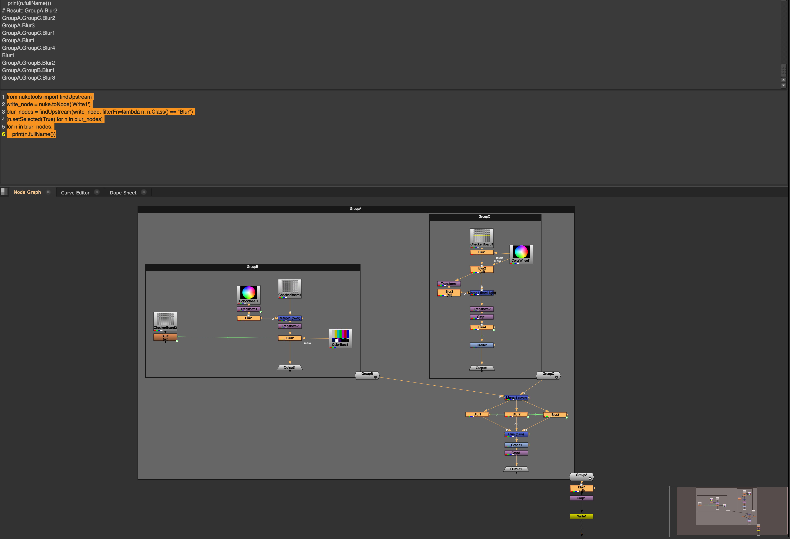

# Software Engineer - 2D Skills Exercise

## Installation

1. Copy `nuketools/` folder to `~/.nuke/`
2. Add `import nuketools` to `~/.nuke/init.py`

## Test
0. test environment:
    - macos 26.2
    - Nuke 16.0v8 (education_collective license)
1. Open `nk/replace_node_test.nk`
2. in the script editor, run following codes.
```python
from nuketools import replaceNode
replaceNode("Blur", "Defocus", "Write1")
```

## Implementation Detail
## Step 1 - Context Management in Groups

### Background
In the Nuke Python API, using the with keyword for Group nodes does not restore the
original parent node context when exiting the scope. Instead, it sets it to the parent of the node used in the scope, which can lead to nodes being created in the wrong context.

### Task
Implement a Python class scopeNode(node) that can be used as a context manager
(with statement) to temporarily switch into the given node context and ensure that the
original context is restored when exiting the scope.
Make sure to demonstrate that your work is behaving correctly

### Example Usage
```Python
with scopeNode(node):
    nuke.createNode("Blur") # This node should be created inside `node`
# Outside the with block, the original context should be restored.
nuke.createNode("Grade")
```

### Approach
- Reviewed existing discussions on this behavior, as it does not appear to be ideal
    - post 1[^1]
    - post 2[^2]
- Studied PEP343 - The `with` statement[^3] to understand context managers
- Identified which nodes have `begin`, `end`, `__enter__`, or `__exit__` methods, which indicate context management support
```Python
ctx_nodes = []
for name in dir(nuke):
    obj = getattr(nuke, name)
    if isinstance(obj, type) and issubclass(obj, nuke.Node):
        if hasattr(obj, 'begin'):
            ctx_nodes.append(name)
print(ctx_nodes)
# Result: ['Gizmo', 'Group', 'LiveGroup', 'Precomp', 'Root']
# all of these are subclasses of Group
```

### Result

- test script: `step1_test.nk`
- in the script editor, running following codes can show the behaviors.
```python
from nuketools import replaceNode, scopeNode

top_node = nuke.toNode('Group1')
target_node = nuke.toNode('Group1.Group1.Group1.Group1')

print("====using default with====")
top_node.begin()
print("starting context :",nuke.thisNode().fullName())
with target_node:
    print("target context :",nuke.thisNode().fullName())
    a = nuke.createNode('Blur')
    a['name'].setValue("defaultContextBlur")
b = nuke.createNode("Grade")
b['name'].setValue("defaultContextGrade")
print("ending context :",nuke.thisNode().fullName())
print("Blur is in the ..: ", a.parent().fullName())
print("Grade is in the ..: ", b.parent().fullName())
top_node.end()

# reset
with nuke.root(): 
    pass 

print("====using scopeNode====")
top_node.begin()
print("starting context :",nuke.thisNode().fullName())
with scopeNode(target_node):
    print("target context :",nuke.thisNode().fullName())
    a = nuke.createNode('Blur')
    a['name'].setValue("scopeNodeBlur")
b = nuke.createNode("Grade")
b['name'].setValue("scopeNodeGrade")
print("ending context :",nuke.thisNode().fullName())
print("Blur is in the ..: ", a.parent().fullName())
print("Grade is in the ..: ", b.parent().fullName())
top_node.end()
```
- we can see where the nodes are created.
```
# Result: ====using default with====
starting context : Group1
target context : Group1.Group1.Group1.Group1
ending context : Group1.Group1.Group1
Blur is in the ..:  Group1.Group1.Group1.Group1
Grade is in the ..:  Group1.Group1.Group1
====using scopeNode====
starting context : Group1
target context : Group1.Group1.Group1.Group1
ending context : Group1
Blur is in the ..:  Group1.Group1.Group1.Group1
Grade is in the ..:  Group1
```
- This shows that a node's context using `with` will back to parent (only one depth up), from `Group1.Group1.Group1.Group1` to `Group1.Group1.Group1`, while `scopeNode` switched back to `Group1`, which is a starting context.


## Step 2 - Upstream Node Search with Filtering

### Background
Given that nodes can be nested into groups, you often need to traverse the graph to find
specific nodes upstream of a given node.

### Task
Using the context manager implemented in ## Step 1, implement a Python function:

```Python
def findUpstream(node, filterFn=None):
"""
Find all upstream nodes for a given node using traversal algorithm.
Args:
node (nuke.Node): The node to start from.
filterFn (callable, optional): Optional function to filter nodes.
Should return True for nodes to keep.
Returns:
list of nuke.Node: List of nodes upstream of the given node that
satisfy the filter.
"""
```
Requirements
1. Use a graph algorithm to traverse upstream nodes.
2. Respect the filterFn to only return nodes that match a condition (e.g., lambda n: n.Class() == "Blur").

### Example Usage
```Python
blur_nodes = findUpstream(write_node, filterFn=lambda n: n.Class() == "Blur")
```

### Approach
- Implemented a DFS-type algorithm (BFS would also work) to traverse upstream nodes.
- When a node has context (a Group-type), traverse inside it using the context manager from Step 1.


### Result
- test script: `replace_node_test.nk`
- running this codes will select all Blur nodes which are upstream of `Write1` node.
```python
from nuketools import findUpstream
write_node = nuke.toNode('Write1')
blur_nodes = findUpstream(write_node, filterFn=lambda n: n.Class() == "Blur")
[n.setSelected(True) for n in blur_nodes]
for n in blur_nodes:
    print(n.fullName())
```
```
# Result: GroupA.Blur2
GroupA.GroupC.Blur2
GroupA.Blur3
GroupA.GroupC.Blur1
GroupA.Blur1
GroupA.GroupC.Blur4
Blur1
GroupA.GroupB.Blur2
GroupA.GroupB.Blur1
GroupA.GroupC.Blur3
```



## Step 3 - Node Replacement

### Background
It is often necessary to swap one tool for another—such as replacing a standard node with a
custom Gizmo or upgrading an outdated plugin. Doing this manually in a large script is
time-consuming and risks breaking complex connections and expressions.

### Task
Implement a Python function replaceNode(sourceClass, targetClass,
node=None) that:
1. Filters by Scope: Finds all nodes of sourceClass that exist upstream of the
specified node. If no node is provided, it should target all nodes of that class in the
script.
2. Executes Seamless Replacement: Creates a node of targetClass for every
instance found, ensuring it inherits the X/Y position of the original.
3. Restores Graph Topology: Automatically reconnects all input pipes and reroutes all
downstream nodes (outputs) so the new node sits exactly where the old one was.
4. Synchronizes Knob Data: Iterates through all knobs; if a knob name exists in both the
source and target nodes, copy the value or the animation/expression across.
5. Script Expressions: Searches the entire Nuke script for any TCL expressions that
reference the old node's name and updates them to reference the new node's name.

### Example Usage
```Python
# Replaces all "Blur" nodes upstream of "Write1" with "Defocus" nodes
replaceNode("Blur", "Defocus", "Write1")
```

### Approach
- Task 1 (filtering by scope) uses Step 2's `findUpstream` and `nuke.allNodes(sourceClass)`
- Searched for a way to copy knobs[^4], but it seems better to check each knob individually
- Reconnection involves disconnecting and reconnecting both inputs and outputs
- Find expressions that reference the old node and replace them with the new node name
- Maintain an old-to-new mapping to connect downstream nodes to the replaced node instead of the old one
- Since traversal is DFS from the bottom, disconnection issues can occur when target nodes are directly connected in a row. The fix was to reverse the search result when replacing nodes.
- A potential improvement would be validating whether expressions remain valid after replacement

### Result
- test script: `replace_node_test.nk`
- result script: `replace_node_test_result.nk`
```python
from nuketools import replaceNode
replaceNode("Blur", "Defocus", "Write1")
```
- To see if all the expression stays well, we can try `EdgeBlur`
```python
from nuketools import replaceNode
replaceNode("Blur", "EdgeBlur", "Write1")
```

## Step 4 - Node Replacement

### Background
You will be provided a Nuke script (replace_node_test.nk) to demonstrate the results of
your work so far.

### Task
Use the node replacement tool to find all Blur nodes upstream of "Write1" and replace
them for Defocus nodes.
Save the modified Nuke script with a new name for us to review.


## Potential improvements
- Currently, the implementation does not check if expressions remain valid after replacing nodes. For example, `parent.Blur2.size*2` changes to `parent.Defocus1.size*2`, but Defocus does not have a `size` knob. It would be good to validate and either delete or warn about invalid expressions.
- It would be useful to support custom knob mapping when replacing nodes. For example, `blur['size']` could be mapped to `Defocus['defocus']`.
- `scopeNode` currently expects Group-type nodes (Group or its subclasses). While not necessary now, generalizing this to other node types might be beneficial in the future.

## Modified nuke script 
`nk/replace_node_test_result.nk`

## References
[^1]: https://community.foundry.com/discuss/topic/156600/nuke-root-begin-breaks-code
[^2]: https://community.foundry.com/discuss/topic/158875/issues-with-context-when-creating-nodes
[^3]: https://peps.python.org/pep-0343/
[^4]: https://learn.foundry.com/nuke/developers/16.0/pythondevguide/_autosummary/nuke.Node.html?highlight=nuke%20node#nuke.Node.writeKnobs
